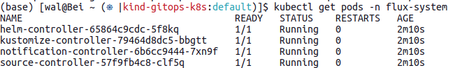
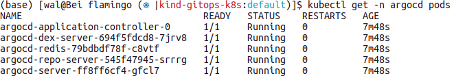

# Flamingo

Flamingo is **the Flux Subsystem for Argo** (FSA). Flamingo's container image can be used as a drop-in replacement for the equivalent ArgoCD version to visualize, and manage Flux workloads, along side ArgoCD.

## Getting Started with a Fresh KIND cluster

In this getting started guide, you'll be walked through steps to prepare your ultimate GitOps environment using ArgoCD and Flux.
We'll bootstrap everything, including installation of ArgoCD, from this public repo. So no manual step of ArgoCD installation is required.
In case you're forking this repo and change its visibility to private, you will be required to setup a Secret to authenticate your Git repo.

At the end of this guide, you'll have Flux running alongside ArgoCD locally on your KIND cluster. You'll run FSA in the anonymous mode, and see 2 pre-defined ArgoCD Applications, each of which points to its equivalent Flux Kustomization.

Install CLIs
- [KIND cli](https://kind.sigs.k8s.io/docs/user/quick-start/#installation) 
- [Flux cli](https://fluxcd.io/docs/cmd/)
- [ArgoCD cli](https://argo-cd.readthedocs.io/en/stable/cli_installation/)

Example install in macOS via [homebrew](https://brew.sh/)

```shell
# install KIND cli
brew install kind

# install Flux CLI
brew install fluxcd/tap/flux

# install ArgoCD CLI
brew install argocd

```

Create a fresh KIND cluster

```shell
kind create cluster
```

Install **Flux**

```shell
flux install

```

You can check flux namespace for running pods `kubectl get pods -n flux-system`




Copy, and paste this snippet to bootstrap the demo.

```shell
cat <<EOF | kubectl apply -f -
---
apiVersion: source.toolkit.fluxcd.io/v1beta1
kind: GitRepository
metadata:
  name: fsa-demo
  namespace: flux-system
spec:
  interval: 30s
  # Change url to your forked gitrepo e.g, https://github.com/GitHubUserID/flamingo
  url: https://github.com/chanwit/flamingo
  ref:
    branch: main
---
apiVersion: kustomize.toolkit.fluxcd.io/v1beta2
kind: Kustomization
metadata:
  name: fsa-demo
  namespace: flux-system
spec:
  prune: true
  interval: 2m
  path: "./demo"
  sourceRef:
    kind: GitRepository
    name: fsa-demo
  timeout: 3m
EOF
```

Check ArgoCD pods are running and Ready `kubectl get -n argocd pods`




Finally, port forward and open your browser to http://localhost:8080

```
kubectl -n argocd port-forward svc/argocd-server 8080:443
```


